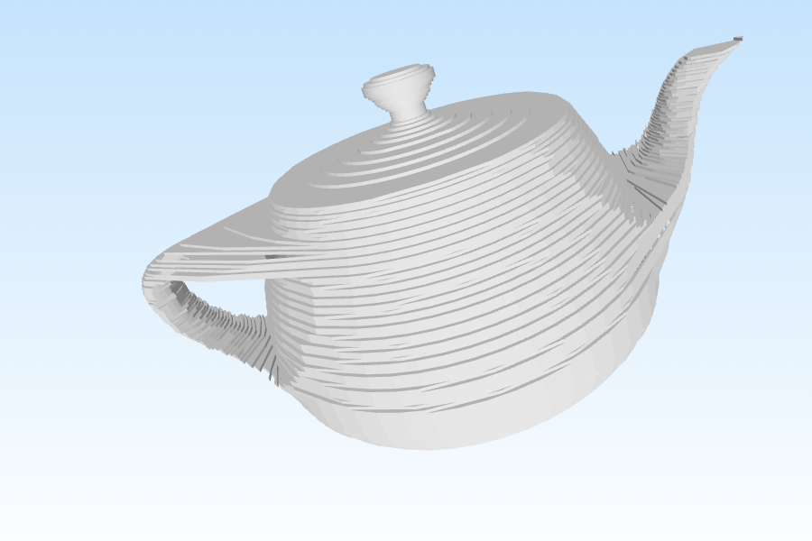

# Scanner3d

A YouTube short shows the overall fuctionning  of the scanner
https://www.youtube.com/shorts/9kxT4gUFv1E

This project was a collaboration of Ulysse Durand, Loïc Thomas, Gabin
Jobert--Rollin and Yann Prost.

It was in the context of the Science of Engineering project part of the
baccalaureate in 12th grade in 2018-2019.

A wooden box with a rotating platform was build. The object to scan was placed
on the rotating platform, a focal lens with a light source sent parallel light
rays on the object and its shadow was cast on a screen recorded by a webcam. In
the end, the shadows of the object under different angles were processed to
rebuild the 3d object.

Two approches were used to rebuild the 3d object

## First method

There is a 3d grid of voxels, at each shadow of the object, voxels out of the
shadow are removed

In the end the mesh is constructed with the Marching Cubes algorithm (completed
in 2019).

It is an approximation of the real shape

The code is [here](scanner3dV1)

## Second method

Here the real intersection of the shadowed areas rotated with their respective
angles is computed.

For each layer (y=constant) multipolygons of the shadows at the different
angles are intersected. 

To reconstruct the mesh from the layer, the horizontal faces are the
symmetrical difference of the multipolygons of adjacent layers, and the
vertical faces are extrusions of the layers 

The code is [here](scanner3dV2)

## Generate input images

To generate artificial images for the programs, use the Processing program in
the `generate` folder

## Report

You can find a summary document [here](readme/Scanner3D.pdf).

Thanks to Yann PROST, Loïc Thomas and Gabin JOBERT--ROLIN for engineering and
building the concrete scanner, making the acquisition of the images and
processing the images.

The object :

The input of the first program:

The output of the first program:

The input of the second program:

The ouput of the second program:

